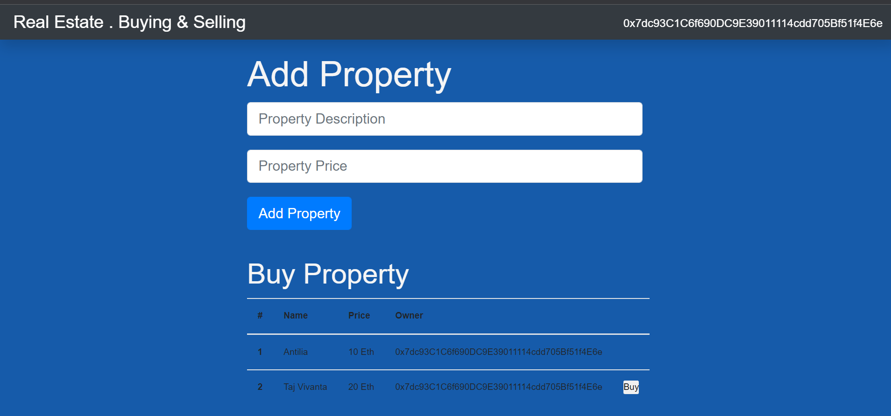
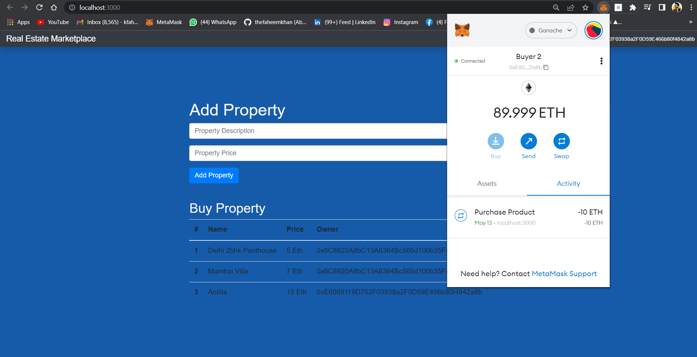

# RealEstate-Marketplace

As we all know a Blockchain is a Disruptive technology and Real estate hasn’t escaped from blockchain disruption . Previously, transacting high value assets such as real estate exclusively through digital channels has never been the norm. Real estate transactions are often conducted offline involving face-to-face engagements with various entities. Blockchain, however, opened up ways to change this. The introduction of Smart Contracts in blockchain platforms now allows assets like real estate to be tokenized and be traded like cryptocurrencies like bitcoin and ether.

## Pain Points in RealEsate that this project is focussing to solve :-
Real estate is incredibly complicated, Ask anyone who's ever bought land or a home it's Time-consuming, Complex, Risky and above all else it's expensive Home Inspectors , Real Estate Agents, Banks, Local Governments everyone needs to check and sign off on your transaction before it can get done and all of them take a cut.

## Scope of the Project :-
In This Project we are gonna show how blockchain technology can make the process of buying and selling real estate much much easier. This work like landowner created a hashes for their land along with the Price. this hash is then tied to the owner's ID and connected to the blockchain since hashes are always a unique value every plot of land and land owner will have a unique ID when linked together Plus because of the blockchains immutability no one can tamper with the records this would create a system of verifiably owned land that could easily be transferred bought and sold in a cryptographically secure manner.

# This Project is Divided into Two parts :
### Smart Contract Deploymet.
- Using Solidity Language to talkwith Ethereum Blockchain.
- Integration Metamask Walletwith smart contract to make Transactions.
- The Key Points of this project is to Make SMART CONTRACT that can Authenticate User And Allow User to List, Sell and Buy Listed Tokenised Property.
- At Final Deploy this project on Ethereum TestNet.

### Interactive Frontend.
- Using React.Js and Node.Js for Ui and Routes.
- Using Web3 JS JavaScript library to Interact with Blockchain Environment.
- Using Ganache & Truffle to create environment that allow us to Test, Run and Deploy without Remix IDE.
- Using ReactJS to create User Interface where user can interact with smart contract.

# Key Points that we can Implement in this projects as a Future work.
- We can Implement IPFS ( Inter Planatery File System ) to store RealEstate Data in a Decentralised manner.
- Geolocation Integration for adding Exact Location with Hashes.
- To Implement a Decentralised Monetary Authority to make sure of authenticity of transactions.
- Replace Ethereum with other newly implemented Network Just like Neo blockchain which is easy to implement.

## Deployed Version.
  
  

## Research Paper Published
International Journal for Modern Trends in Science and Technology, 8(06): 203-206, 2022
Copyright © 2022 International Journal for Modern Trends in Science and Technology 
ISSN: 2455-3778 online
DOI: https://doi.org/10.46501/IJMTST0806033
Available online at: http://www.ijmtst.com/vol8issue06.html
Blockchain in Real Estate
